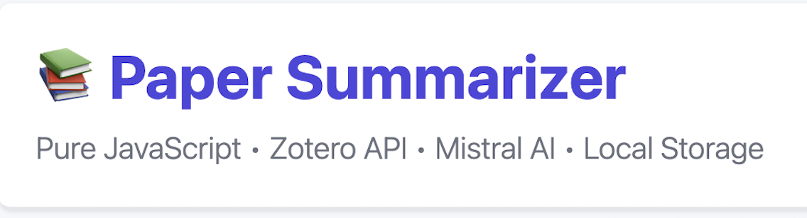
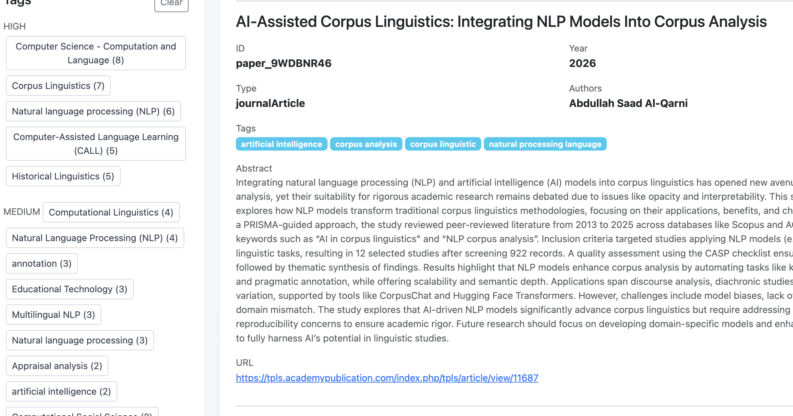
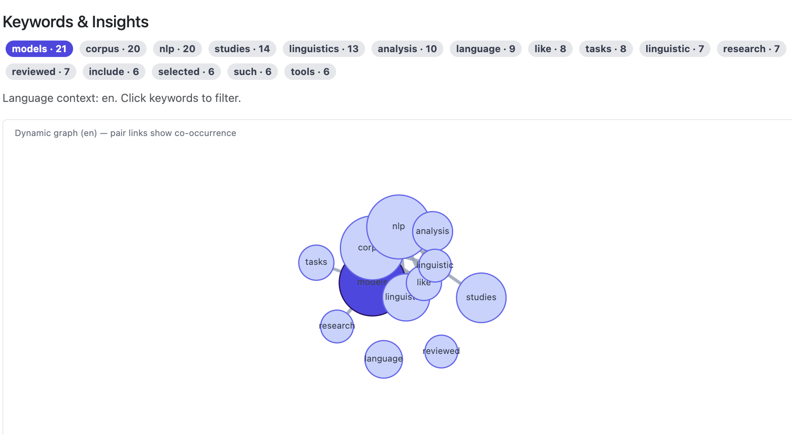

# Résumé de Papier (Pur JavaScript)
*(English version: [README.md](README.md))*

<p align="center">
	
</p>

**Auteur:** Bowen Zhang  
**Ce travail a été réalisé dans le cadre d'un stage financé par le Consortium CORLI : https://corli.huma-num.fr**
**Copyright:** Centre National de la Recherche Scientifique (CNRS)
**Licence:** Ce projet est distribué sous la licence CC BY-NC-SA 4.0 — voir https://creativecommons.org/licenses/by-nc-sa/4.0/deed.fr

**Remerciements:**  
L'auteur remercie sincèrement les encadrant·es : Thomas Gaillat, Maria ZIMINA-POIROT, et Sarra El Ayari pour leur supervision et soutien tout au long de ce projet.

## Aperçu du projet

**Paper Summarizer** est un outil frontend en JavaScript pur pour récupérer les métadonnées des articles académiques depuis Zotero et générer des résumés et analyses multilingues par Mistral (mistral-small-latest).

**Fonctionnalités principales:**
- Synchronisation des données Zotero : supporte les bibliothèques utilisateur/groupe, récupère le titre, résumé, auteurs, année, DOI, etc.
- Génération de résumés : génère des résumés en trois parties (aperçu général, méthodologie, description de l'ensemble de données) pour chaque article
- Gestion des étiquettes et filtrage : affiche les étiquettes par niveau de fréquence avec support de filtrage multi-sélection
- Graphe de réseau de mots-clés : algorithme force-directed visualisant les mots-clés et leurs relations de co-occurrence
- Mise en cache locale : articles et résumés stockés dans LocalStorage du navigateur

<p align="center">
	
	<br>
	<em>Capture d'écran : interface principale — liste des articles et filtres.</em>
</p>

**Pile technologique:**
- Frontend : HTML + Bootstrap 5 + JavaScript vanilla (sans framework)
- Sources de données : Zotero Group, ID API Zotero, API Mistral (modèle : mistral-small-latest)
- Déploiement : serveur statique uniquement

**Cas d'utilisation:**
Gestion des références de groupe de recherche, enseignement en classe, navigation rapide des revues de littérature.

## Configuration initiale

Pour la première configuration sur une nouvelle machine :

- Guide chinois : [INSTALL_FROM_ZERO.md](INSTALL_FROM_ZERO.md)
- Guide anglais : [INSTALL_FROM_ZERO_EN.md](INSTALL_FROM_ZERO_EN.md)
- Guide français : [INSTALL_FROM_ZERO_FR.md](INSTALL_FROM_ZERO_FR.md)

## Architecture actuelle

- Frontend : page unique [index.html](index.html)
- UI : HTML + Bootstrap
- Runtime : JavaScript vanilla dans le navigateur
- Données : fichiers JSON dans [data](data) et [summaries](summaries)
- Configuration locale optionnelle : [config.local.js](config.local.js) (non commité)

<p align="center">
	
	<br>
	<em>Capture d'écran : vue détaillée d'un article et de son résumé.</em>
</p>

Aucun backend Node.js n'est requis.

## Questions du relecteur

**Validation des entrées et limites de taille**
- Ce projet n'accepte pas de téléversement de fichiers locaux arbitraires, il n'existe donc pas de chemin d'analyse de gros fichiers pouvant faire planter l'application.
- Les entrées utilisateur se limitent aux identifiants Zotero, aux ID et aux clés API, qui sont validés avant l'envoi des requêtes.
- La récupération des articles est paginée et bornée : `fetchFromZotero()` utilise les limites `pageSize` et `maxItems`, et l'interface ne traite que les métadonnées retournées, pas les pièces jointes brutes.
- Si une réponse Zotero/API est mal formée ou incomplète, l'application filtre les éléments non pris en charge et revient à des valeurs sûres au lieu d'essayer d'analyser un contenu corrompu.

**Dépendances / fichier de dépendances**
- Il s'agit d'un projet frontend statique, il n'y a donc pas encore de `package.json` ni de `requirements.txt`.
- Les dépendances d'exécution sont volontairement minimales : un navigateur moderne plus un serveur statique comme `./start-server.sh` (qui utilise `http-server`, `python3` ou `python` selon les disponibilités).
- Les intégrations optionnelles sont documentées dans `README.md` et `.env.example` / `config.local.example.js` plutôt que dans un manifeste de dépendances.
- Si le projet reçoit plus tard des scripts Node/Python, un `package.json` ou un `requirements.txt` pourra être ajouté sans changer le runtime frontend actuel.

## Outils et transparence

- Métadonnées : API Zotero (bibliothèques Zotero de groupe/utilisateur)
- Enrichissement DOI/métadonnées : API Crossref (optionnel)
- Modèle d'IA pour les résumés : Mistral — `mistral-small-latest` (tous les résumés enregistrés dans le dossier `summaries/` ont été produits par ce modèle)
- Interface frontend : Bootstrap 5, JavaScript vanilla
- Runtime local : LocalStorage du navigateur pour le cache ; serveur statique (`http-server` ou `python http.server`) pour servir les fichiers

Notes sur la génération par IA :
- Les fichiers contenant du contenu généré par IA (sorties) — `/summaries/*.json` — incluent chacun les champs `source` et `model` (par ex. `"source": "mistral", "model": "mistral-small-latest"`).
- Les scripts d'exécution qui appellent le modèle d'IA : `index.html` (flux de résumé côté client), `mistral_summarizer.py` et `src/mistralClient.js` (aides/emballages). Ces scripts envoient des requêtes à `mistral-small-latest` et enregistrent le texte retourné comme résumés.
- Aucun fichier source complet n'est généré par le modèle d'IA ; seuls les résumés d'articles et les sorties textuelles sont produits par Mistral.

Si vous avez utilisé une autre assistance IA pour produire la documentation ou les commentaires de code, veuillez ajouter une note explicite ici en identifiant le fichier et le modèle utilisés.

Note sur le contenu généré par l'assistant :
- Une partie de la documentation et des commentaires inline de ce dépôt (notamment des parties de `index.html` et `config.local.example.js`) ont été générées avec GPT-5 mini. Les sorties générées sont enregistrées dans `summaries/*.json` avec les métadonnées `source`/`model` lorsqu'elles existent.
- Certaines sections de code et certains extraits de scripts d'aide ont été générés avec Claude Code Haiku 4.5 ; les attributions par fichier sont ajoutées dans les en-têtes de fichiers lorsque c'est pertinent.

## Démarrage rapide

Depuis la racine du dépôt téléchargé :

```bash
chmod +x ./start-server.sh
./start-server.sh
```

Puis ouvrez :

`http://localhost:8000`
